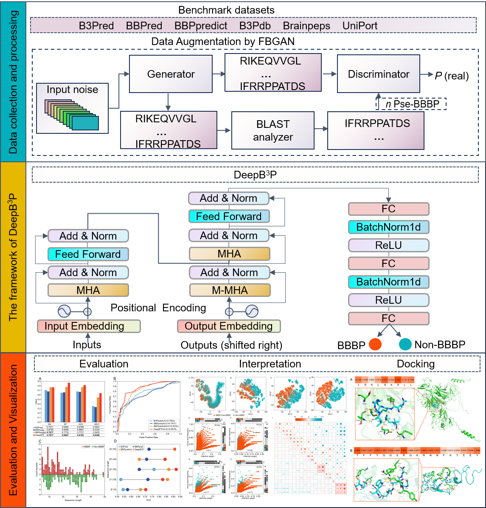

# DeepB3P
DeepB3P: A Transformer-Based Model for Identifying and Generating Blood-Brain Barrier Penetrating Peptides by Using Feedback GAN 
The feedback generative adversarial network (FBGAN) model was employed to effectively generate analogous BBBPs, addressing data imbalance.

 

# Environment
1. The model training and testing process was performed on a CentOS Linux system. The CPU was an Intel(R) Xeon(R) Gold 62336Y CPU @ 2.40 GHz, which had 48 logical CPUs. The GPU was the NVIDIA A100, which had a memory capacity of 80G.
2. The packages used for deepB3P are available in environment.yml and requirements.txt, and can be installed using conda install and pip install respectively.
# Test deepB3P on new data
`python predict_user.py fasta_file`  
***The input file must be in fasta format*** 
The output file is prob.csv in the current directory, containing the input sequences and predicted probabilities
# Test FBGAN-based model
`python  fbgan_model.py` 
1.  The number of sequences output can be made active by setting the n_sequences parameter in the config_fbgan.py file
2.  if n_epochs != 1,000, then train a new FBGAN model, and user can modify the parameter for training a new model in config_fbgan.py
3.  the output file is in the fbgan/out

